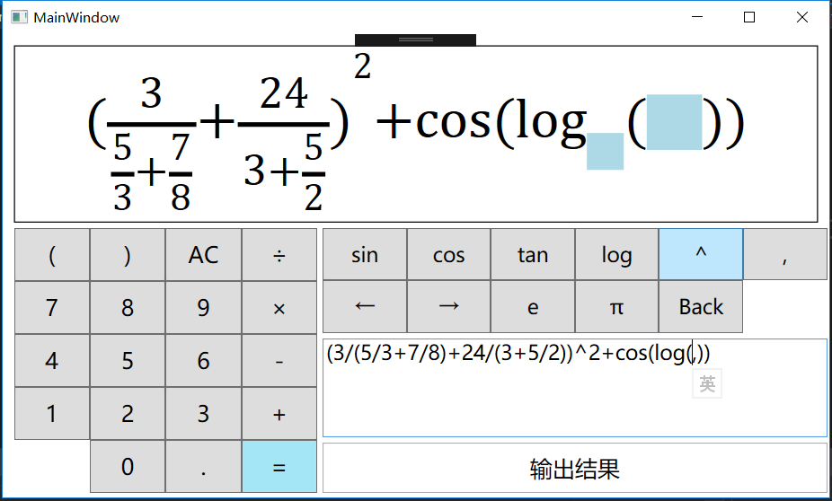

# Simple Calculator——More than simple！
This is a modern scientific calculator, which features in real-time rendering math expressions you type in..

It's a WPF application written in `C#`.

## Features
- Real-time rendering of math expressions

  Formulas can be rendered beautifully according to standard mathematical form. That includes fraction, exponentiation and logarithm.
- Highly fault-tolerant parser

  As shown in the photo, most incomplete expressions can still be properly parsed, which leads to an appearance of placeholders in the render area.

  The parser wouldn't be accomplished without the help of [ANTLR](https://github.com/antlr/antlr4) tool. Many thanks to them!
- Flexible input methods
  You can either input via keyboard or buttons. Autocomplete is supported.

## Platforms
- Windows XP (.NET 4 required)
- Windows 7+
## Download
Click [here](https://github.com/Calculator-Project-Group/simple-calculator/releases/download/v1.0.0.0/calculator.zip) to download the latest binary release.
Of course, alternatively, you can built the application by yoursef using Visual Studio. Don't forget to install the required NuGet packages first :).
## Usage
### Overview of UI

### Interaction
You can either input the linear expression to be calculated via keyboard, or using buttons shown above.
> A tip about the autocomplete facility:
>
> The `(` button supports autocomplete by default. However, you can disable this using right click.

The format of expressions you should input strictly follows a grammar definition specified by [Calc.g4](https://github.com/Calculator-Project-Group/simple-calculator/blob/master/calculator/parser/Calc.g4). But you needn't worry much for that because our grammar takes accounts of the most common forms of linear expressions, and the expressions you would naturally think of will usually be properly accepted by our parser.

Calculate the expression pressing "`=`" button.

## Calculation Accuracy

Simple Calculator is intended for daily use, and doesn't not handle high precision numbers. 

It stores 64-bit float point numbers and integer numbers internally, and supports accuracy of 15 and 18 decimal digits respectively.